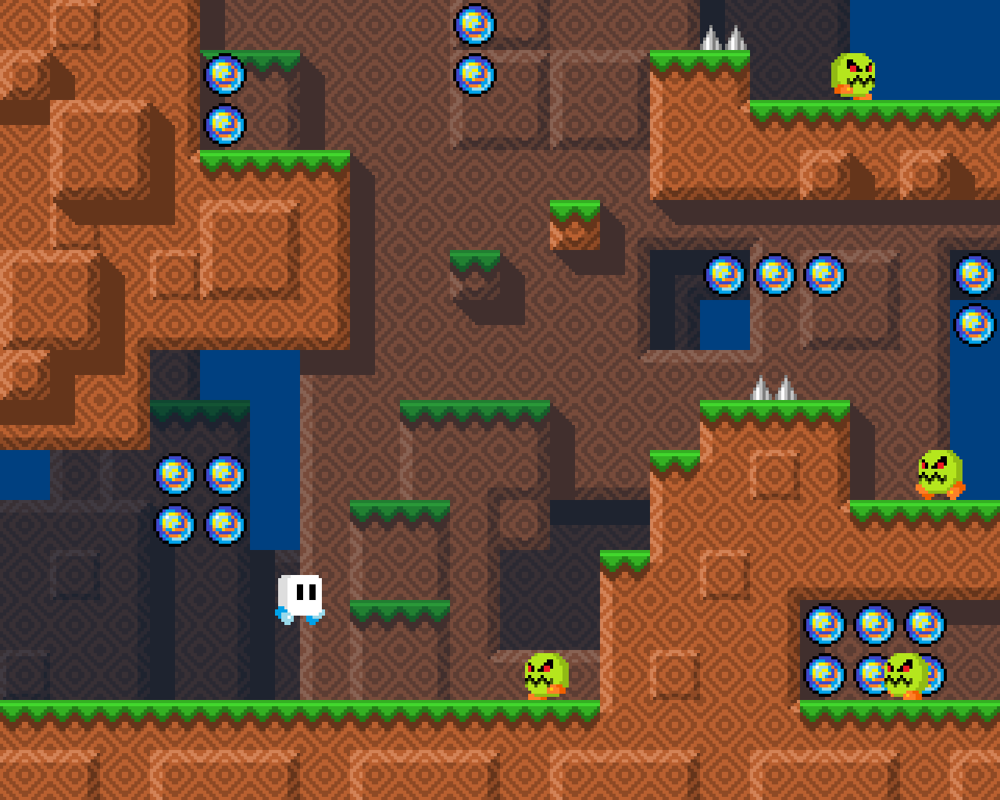

# Learning the Basics of Unity

## Overview

In this project, you will first learn the basics of Unity by completing a
Driving Simulator. Then, you will apply what you learned while creating that
driving simulator to fix and implement a Flying Simulator.

* [Setup your repository](#setup-your-repository)
  * [Sign up for the project](#sign-up-for-project)
* [Milestones](#milestones)
  * [Milestone 1](#milestone-1)
  * [Milestone 2](#milestone-2)
  * [Milestone 3](#milestone-3)
  * [Milestone 4](#milestone-4)
  * [Milestone 5](#milestone-5)
* [Grading](#grading)
  * [Computational Thinking](#computational-thinking)
  * [Computing, Programming and Practice](#computing-programming-and-practice)
  * [Skills of a Student](#skills-of-a-student)
* [Getting Help](#getting-help)

## Setup your repository

### Sign up for Project

Sign up for the project repository here: [https://classroom.github.com/a/tJfBiG39](https://classroom.github.com/a/tJfBiG39)

After your repository has initialized it, clone it to your computer. I recommend
putting it in your `ap-csp` directory.

After you've cloned your repository, run the `setup.sh` script in the root of
that repository to initialize it's configuration.

Upon completion it should display a message similar to this one:

```
######################################################
# SETUP IS COMPLETE. YOU SHOULD NOW CREATE A         #
# `develop` BRANCH BY RUNNING THE FOLLOWING COMMAND: #
#                                                    #
# git checkout -b develop                            #
#                                                    #
# THEN PUSH THAT BRANCH TO GITHUB BY RUNNING THE     #
# FOLLOWING COMMAND:                                 #
#                                                    #
# git push -u origin develop                         #
#                                                    #
# AFTER PUSHING, OPEN A PULL REQUEST FROM YOUR       #
# `develop`  BRANCH TO THE `main` BRANCH BY VISITING #
# THIS REPO ON GITHUB, CLICKING `Pull Requests`      #
# THEN `New pull request`. THE BASE BRANCH SHOULD BE #
# `main` and THE COMPARE BRANCH SHOULD BE `develop`. #
#                                                    #
# FINALLY, ADD YOUR INSTRUCTOR AS A REVIEWER ON      #
# GITHUB. THIS IS HOW YOUR INSTRUCTOR WILL SEE YOUR  #
# WORK.                                              #
######################################################
```

Follow the directions to create a `develop` branch as well as pushing your
`develop` branch to Github.

Finally, create a pull request from your `develop` branch to the `main` branch
and assign `jcollard` as a reviewer.


## Milestones

### Milestone 1

Due Date: Friday November 6th @ 8AM

An introduction to all of the basic mechanics to create a 2D Platformer in Unity
is available on YouTube: [Tofu Land Tutorial](https://youtu.be/UAyXpDhJ3XE)

The first Milestone is to complete all of the videos and challenges therein.

**Note:** You do not need to create a new project as described in the Tofu Land
Setup video. Instead, you should add the project located inside of this
repository. 

All code that you would like to count toward your evaluation should be part of a
`tag` on in your repository called `milestone-1`. This can be created by running
`git tag milestone-1`. Then push your tag to your repository by running `git
push -u origin milestone-1`. The date of this tag creation will be used to
determine when your work was submitted.

### Milestone 2

Due Date: Thursday November 12th @ 8AM

Now that you have completed the base tutorial for creating Tofu Land, you will
design a new scene using the [additional
assets](https://drive.google.com/file/d/1I_i_layc87p4qZp1H6dw8XLL4VWbZp9w/view?usp=sharing).

These assets include many more background tiles, a set of orb sprites, and
additional Tofu and Enemy sprites. You may also wish to find more open source
sprites from [OpenGameArt.org](https://opengameart.org/). 

#### Steps to complete Milestone 2

1. Import all of the new assets into your project
2. Create a new Scene
3. Create a unique Scene that has platforms and Enemies
4. In addition to creating platforms, add edge colliders to create walls that
   prevent the Tofu Character. 

Here is an example Scene for Reference:



All code that you would like to count toward your evaluation should be part of a
`tag` on in your repository called `milestone-2`. This can be created by running
`git tag milestone-2`. Then push your tag to your repository by running `git
push -u origin milestone-2`. The date of this tag creation will be used to
determine when your work was submitted.

### Milestone 3

Due Date: Monday November 16th @ 8AM

Now that you have designed a basic scene, spice it up by adding additional Enemy
types each that use a different controller for their logic. For this portion,
you must create 2 additional enemies:

1. An enemy that hops rather than walking
2. An enemy that always moves toward the Tofu's position

#### Bonus: 2 Additional Enemies

To receive a score of Advanced on this project, you must design two unique
enemies that implement additional logic. You must have these enemies approved to
receive full points. Be sure to post your ideas on Piazza for approval.

All code that you would like to count toward your evaluation should be part of a
`tag` on in your repository called `milestone-3`. This can be created by running
`git tag milestone-3`. Then push your tag to your repository by running `git
push -u origin milestone-3`. The date of this tag creation will be used to
determine when your work was submitted. submitted. 

### Milestone 4

Due Date: Thursday November 19th @ 8AM

For this Milestone, you must add in Spikes that cause the Tofu Character to be
moved back to the start of the level when they touch the pointy side of the.
This logic can also be used to make the Tofu Character respawn when an enemy
touches them rataher than being knocked away.

#### Bonus: Give the Tofu Multiple Hit Points

To receive a score of Advanced on this project, you must add a `health` variable
to your Tofu character that is reduced when they touch the spikes. When the
`health` variable is zero their `health` variable is set back to full and they
are moved to the start of the level.

All code that you would like to count toward your evaluation should be part of a
`tag` on in your repository called `milestone-4`. This can be created by running
`git tag milestone-4`. Then push your tag to your repository by running `git
push -u origin milestone-4`. The date of this tag creation will be used to
determine when your work was submitted. submitted. 

### Milestone 5

Due Date: Monday November 23rd @ 8AM

The final part of the project is to add in a unique feature. Propose an idea on
Piazza for approval. Here are some ideas:

1. Sound Effects
2. A user interface that tracks the number of Orbs collected by the Tofu Player
3. A Game Over Screen when the Tofu dies
4. A second Scene that the player spawns on when they have killed all enemies.

**Note:** Your proposed idea must be approved to receive full points. 

Your completed Tofu Land Scene is due at this time. All code that you would like
to count toward your evaluation should be part of a `tag` on in your repository
called `milestone-5`. This can be created by running `git tag milestone-5`. Then
push your tag to your repository by running `git push -u origin milestone-5`.
The date of this tag creation will be used to determine when your work was
submitted. submitted. 

## Grading

#### Computational Thinking

| Advanced                                                                         | Proficient                                                                  | Basic                                                                                                                      | Below Basic                                            |
|----------------------------------------------------------------------------------|-----------------------------------------------------------------------------|----------------------------------------------------------------------------------------------------------------------------|--------------------------------------------------------|
| Student creates 5 different enemy types                                          | Student creates the 3 basic enemies for Milestone 3                         | Student completes all of the Tutorial Video features                                                                       | Student does not complete all features in video series |
| Student creates a health variable to give the Tofu Character multiple hit points | Student utilizes most of the provided tile sprites to create a unique scene | The Tofu can Jump, Walk left and right, and is animated based on the direction of facing                                   |                                                        |
| Student proposes and implements a unique feature                                 | Student adds Spikes that cause the Tofu to respawn on touching              | Enemy animates the direction of facing and patrols on a platform, knocks back the Tofu, and is destroyed when jumped upon. |                                                        |
|                                                                                  | Student completes all non-bonus features listed in this README.md           |                                                                                                                            |                                                        |
### Computing, Programming and Practice

Demonstrate how you tested your assignment, write comments, and provide well
written commits.

| Advanced                                                                                                                                       | Proficient                                                                                       | Basic                                                                                                                   | Below Basic                                                                    |
|------------------------------------------------------------------------------------------------------------------------------------------------|--------------------------------------------------------------------------------------------------|-------------------------------------------------------------------------------------------------------------------------|--------------------------------------------------------------------------------|
| Student provides Screenshots / Videos of their final solutions and adds them to their README.md                                                | Student created README.md file stating how they tested their solutions and any known bugs.       | Student created a README.md for their solutions                                                                         | Student did not complete a README.md                                           |
| Student comments all methods describing all inputs and side effects as well as comments inside their methods describing tricky implementations | Student wrote comments inside their methods describing the tricky parts of their implementation. | Student wrote some comments                                                                                             | Student did not write comments                                                 |
| Student comments all member variables describing their use                                                                                     | Student comments most of their member variables                                                  | Student comments some of their member variables. Comments may not be particularly useful or contains grammatical errors | Student did not write comments                                                 |
| All of the students commits follow the commit message template.                                                                                | Most of the students commits follow the commit message template.                                 | Some of the students commits follow the commit message template                                                         | Few or none of the students commit messages follow the commit message template |

### Skills of a Student

Your skills of a student covers your StudentLog repository, your in class time
management, meeting deadlines, asking for help when needed, and helping others
when able.

| Advanced                                                                           | Proficient                   | Basic                                                    | Below Basic                                          |
|------------------------------------------------------------------------------------|------------------------------|----------------------------------------------------------|------------------------------------------------------|
| Manages time well in class, stays focused on work  at hand at all times            | Focuses on work in class     | Focuses at times, can get distracted                     | Uses class time poorly, is frequently distracted     |
| Meets all deadlines, on or ahead of schedule                                       | Meets deadlines              | Delivers close to deadline, may be late  by a day or two | Delivers work late or not at all                     |
| Advocates for self, seeks clarification when needed  and volunteers to help others | Seeks assistance when needed | Needs prompting to seek assistance                       | Does not seek assistance or ask for help when needed |

## Getting Help

All questions should be posted to the class Piazza board. You are also
encouraged to help other students who post on Piazza. When you post your
question, be sure to include as many details as possible for reproducing the
issue you're having.

Questions you should answer when asking a question include:

1. What are you trying to do?
2. What did you try?
3. What was the result?

Work hard to make sure the person trying to answer your question can reproduce
your error. Share your files so others can run exactly what you're running.

Also, include screenshot!

Formulating good questions is a good life long skill. You should try asking your
question on Piazza before seeking out synchronous time with Mx. Collard.
However, if you would like to meet to discuss synchronously, first, look at [Mx.
Collard's Calendar](http://tinyurl.com/mx-collard-calendar), then send them an
email with at least two proposed times you would like to meet.